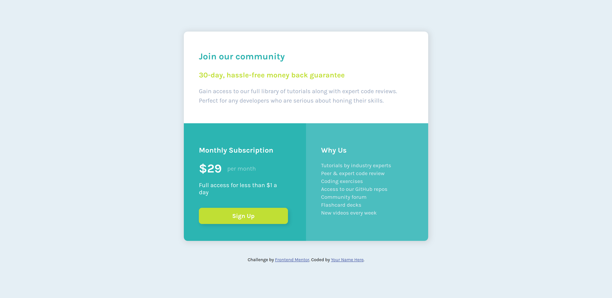

# Frontend Mentor - Single price grid component solution

This is a solution to the [Single price grid component challenge on Frontend Mentor](https://www.frontendmentor.io/challenges/single-price-grid-component-5ce41129d0ff452fec5abbbc). Frontend Mentor challenges help you improve your coding skills by building realistic projects.

### The challenge

Users should be able to:

-   View the optimal layout for the component depending on their device's screen size
-   See a hover state on desktop for the Sign Up call-to-action

### Screenshot

Desktop Version



Mobile Version


-   [Live site URL](https://your-live-site-url.com)

### Built with

-   Semantic HTML5 markup
-   CSS custom properties
-   Flexbox
-   CSS Grid
-   Mobile-first workflow
-   [React](https://reactjs.org/) - JS library
-   [Next.js](https://nextjs.org/) - React framework
-   [Styled Components](https://styled-components.com/) - For styles

### What I learned

How to style this:


```css
.price {
    display: flex;
    align-items: center;
    font-size: 2rem;
    font-weight: 700;
    margin-top: 0;
    margin-right: 0.9rem;
    margin-bottom: 0.5rem;
}

.price span {
    font-size: 1rem;
    margin-left: 0.9rem;
    font-weight: 400;
    opacity: 0.5;
}
```

## Author

-   Facebook - [Ta Thanh Dat](https://www.facebook.com/tathanh.dat.5/)
-   Frontend Mentor - [@Ta Thanh Dat](https://www.frontendmentor.io/profile/tathanhdat)
